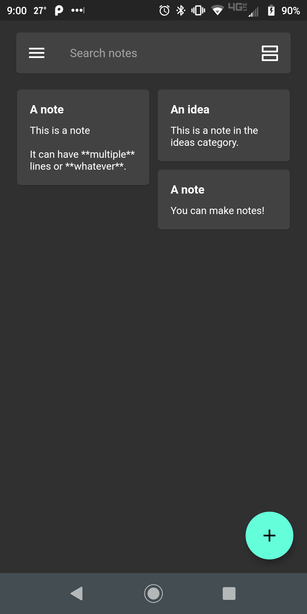
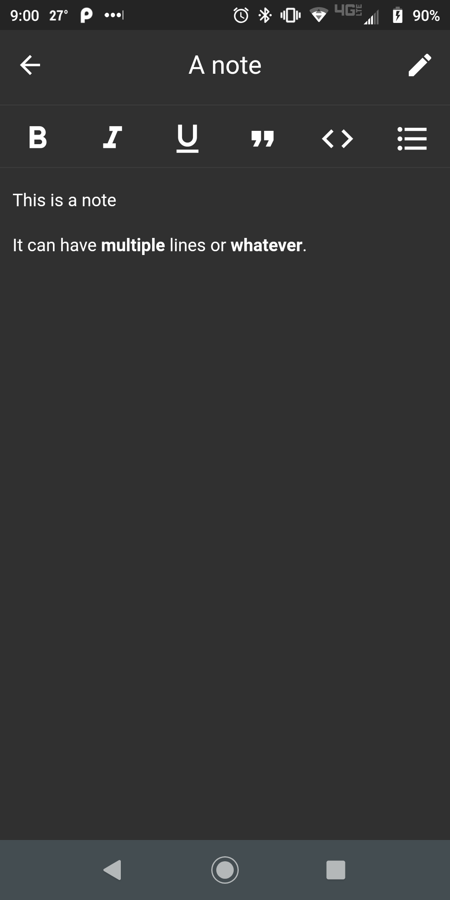
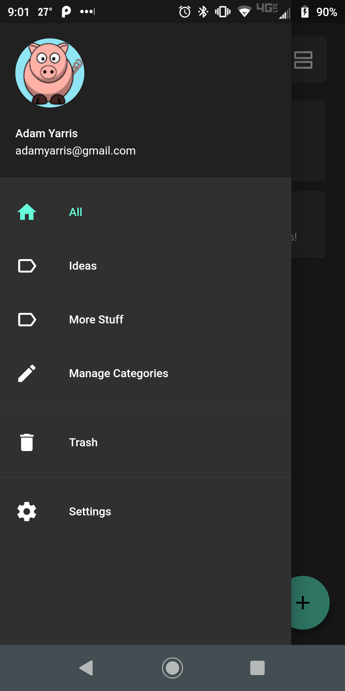
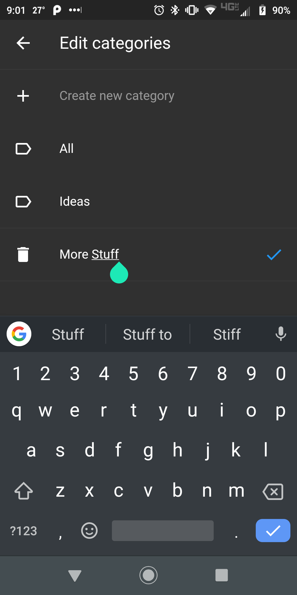

# Notedown

Notedown is a Markdown note taking app. It is a Flutter app that is meant to be used on mobile devices, the web, and desktop. It currently uses Firebase's Firestore to store notes and category information, and automatically saves data and fetches it from the database. It uses Google authentication to protect the notes and for syncing purposes, and allows for note editing/creation. It is currently functional with the ability to create and edit notes, and create, edit, and delete categories.

Here is a short demo video of the app in its current state: https://youtu.be/97lbhdIAuXs

The following are some screenshots of the current UI, most features are functional (Except searching):

   
